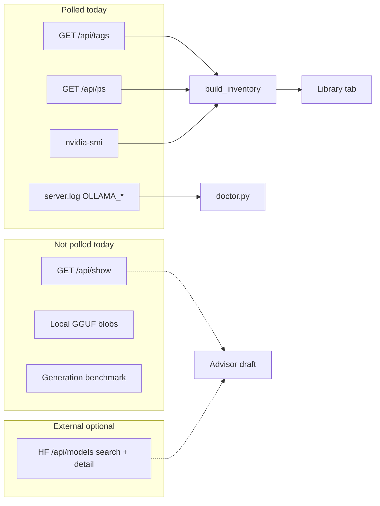
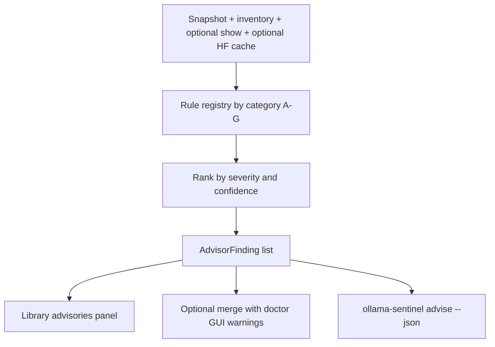

# Model optimization advisor (draft vision)

**Status:** exploratory draft — not a build spec. **Research pass done 2026-08-31**; see *Measured on this fleet* below, which resolves several open questions and corrects assumptions in the tables that follow. Intended for research, scope negotiation, and narrowing with additional lessons learned before any implementation.

## Why this exists

ollama-sentinel's core alarms (SPILL, PCIe PAGING, VRAM PRESSURE) catch **runtime failure**. To be useful to experts, beginners, and odd hardware setups, the app also needs to help with **choices people get wrong before anything alarms**:

- Wrong quant for available VRAM
- Server config that silently wastes memory (KV dtype, context, parallel slots)
- Models with optimization features present but not enabled (MTP / draft)
- Installed bases that are outdated or superseded
- Hardware that cannot realistically run what was pulled

We **flag and suggest**; we do **not** guarantee fit, speed, or that a recommendation will work on every Ollama build.

---

## Design principles


| Principle                  | Meaning                                                                                                              |
| -------------------------- | -------------------------------------------------------------------------------------------------------------------- |
| **Read-only default**      | No auto-pull, unload, or env mutation unless user explicitly runs existing commands                                  |
| **Advisory vs alarm**      | Hard alarms = measured runtime truth (`size_vram < size`, VRAM >95%). Advisories = heuristics with confidence labels |
| **Show your work**         | Every advisory cites inputs: free VRAM, quant, `draft_num_predict`, HF `lastModified`, etc.                          |
| **No guarantees**          | Copy like "may help", "worth trying", "not supported on this platform"                                               |
| **Progressive disclosure** | Beginners see plain English + remedy; experts see IDs, raw fields, links to HF/Ollama docs                           |
| **Offline-first core**     | Name parsing and local APIs work without HF; suggestions degrade gracefully when network is down                     |


---

## What we can observe today (baseline)




**Already in codebase:**

- `[inventory.py](ollama_sentinel/inventory.py)`: `quantization`, `family`, `parameter_size`, `would_spill`, `inventory_detail_line()`
- `[doctor.py](ollama_sentinel/doctor.py)`: config drift, orphans, stale context/keep_alive, spill footguns — `DoctorFinding` + `remedy`
- `[catalog.py](ollama_sentinel/catalog.py)`: HF search, `parse_model_detail`, GGUF variants, `last_modified`
- `[alarms.py](ollama_sentinel/alarms.py)`: SPILL / PAGING / VRAM only — advisories should **not** change `--once` exit codes unless explicitly decided later

---

## Measured on this fleet (2026-08-31) — research results

Everything below was read off live machines, not inferred. It resolves research backlog items
**1, 3 (partly), 5, 6**, and it changes several confidence ratings in the tables that follow.

Hosts probed:

| Host | GPU | Ollama | Role |
|---|---|---|---|
| **ts-cr-desktop** (this box) | RTX 3090 24 GB, CUDA | **0.33.2** | 6 models; tray app, no `serve-*.bat`; env `CONTEXT_LENGTH=65536 FLASH_ATTENTION=1 KV_CACHE_TYPE=q8_0 KEEP_ALIVE=30m HOST=0.0.0.0:11434` |
| **ts-ubuntu-server** (100.64.188.1) | **Radeon RX 6800 16 GB, `ollama/ollama:rocm` in Docker** | **0.33.2** | **20 models**, 2 loaded, currently **spilling** |
| ts-desktop (100.69.126.9) | RTX 3070 8 GB | 0.32.15 | not answering; embeddings-only by house rule |
| ts-msi-laptop (100.81.65.112) | **RTX 3080 Laptop 16 GB + Intel UHD iGPU**, 63.8 GB RAM, 133 GB free | **not installed** | Inspected 2026-08-31 — see *The laptop* below |
| ts-haxology | none | — | Open WebUI, consumes the two servers above |

### `/api/show` is richer than the draft assumed — and portable

Top-level keys on 0.33.2 (**identical on Windows/CUDA and Linux/ROCm**): `capabilities`,
`details`, `model_info`, `modelfile`, `parameters`, `template`, `tensors`, `license`, and — only
when present — **`projector_info`**, **`system`**, and **`requires`**.

- **`model_info`** is the full GGUF header (41 keys for `qwen3.8:27b-mtp-q4_K_M`): `block_count`,
  `attention.head_count_kv`, `attention.key_length` / `value_length`, `context_length`,
  `full_attention_interval`, `ssm.*`, and `expert_count` / `expert_used_count` on MoE.
- **`tensors`** is a full list of `{name, type, shape}` (866 entries). Summing
  `prod(shape) x bits_per_type` gives the **exact weight footprint** — 16.800 GB for the MTP tag
  (Q4_K 12.262 + Q6_K 4.527 + F32 0.011), vs the 17.74 GB `tag.size` from `/api/tags` (which also
  counts the mmproj blob). Free, offline, and strictly better than `tag.size` for fit math.
- **`parameters`** is a flat text block, not a dict — parse `draft_num_predict\s+(\d+)` out of it.
  It is **absent entirely** on some models (`granite4.1:8b` returns `None`).
- **`/api/show` is a better quant source than `/api/tags`.** `granite4.1:8b` reports
  `quantization_level: "unknown"` in tags but **`Q8_0`** (`general.file_type: 7`) in show;
  `batiai/qwen3.6-27b:iq3` reports `unknown` in tags but **`IQ3_XXS`** in show. `inventory.py`'s
  quant column is wrong today for both. Also expect quant strings the parser must not choke on:
  `MXFP4`, `IQ3_XXS`, `unknown`.
- **`/api/show` can fail per model.** `gpt-oss:20b` on the ROCm host returns
  `{"error": "tensor \"blk.0.ffn_down_exps.weight\" size overflow"}`. The show cache must record
  and skip failures per tag, never abort the sweep, and the Library must show "no data" rather
  than an absent advisory that reads as "fine".

### MTP detection is a solved problem — and it is *not* name parsing

| Evidence | `qwen3.8:27b-mtp-q4_K_M` | `qwen3.8:27b-heretic` |
|---|---|---|
| `model_info["qwen35.nextn_predict_layers"]` | `1` | absent |
| tensors matching `blk.*.nextn.*` | 4 (`eh_proj`, `enorm`, `hnorm`, `shared_head_norm` on blk.64) | none |
| `parameters` -> `draft_num_predict` | `4` | absent |
| `details.parent_model` | `qwen3.8:27b-q4_K_M` | `""` |

So `model:mtp_dormant` is **High** confidence, not Medium: architectural tensors present plus
`draft_num_predict` unset/0 is direct evidence, no heuristics. **Delete `name:mtp_missing` from
table E** — architecture beats filenames, and the `-mtp` name token is now redundant.

Counter-example from the ROCm host: `batiai/qwen3.6-27b:iq3` is the same `qwen35` architecture,
64 blocks, **no `nextn_predict_layers` key and no nextn tensors** — so the family alone does not
imply MTP. Name- or family-based MTP inference would have produced a false positive here.

Both 27B tags on this box also report `vision` in `capabilities` and carry a 461M-param
`qwen3vl_merger` mmproj in `projector_info` — the "mmproj / vision" row in table G is
**computable exactly**, not "Poor".

### New advisory the draft missed: `model:requires_newer_ollama`

`/api/show` returns **`requires: "0.32.12"`** on the MTP tag. Models declare a minimum server
version. This fleet is version-mixed (**0.33.2** here and on ts-ubuntu-server, **0.32.15** on
ts-desktop) and weights get **hand-copied between boxes** (the heretic tags were copied off
ts-desktop when it dropped to a 3070), so a model can silently land somewhere that cannot run it.
Free, offline, **High** confidence.

### The KV estimator is harder than the draft hopes — and `/api/ps` cannot validate it

For `qwen3.8:27b-mtp-q4_K_M` at ctx 65536, `kv_cache_type=q8_0`, flash attention on:

| Method | Result |
|---|---|
| Exact weights from `tensors` | **16.800 GB** |
| Textbook KV `ctx x layers x kv_heads x (k_len+v_len) x bytes`, f16, all 65 layers | 17.45 GB |
| Same, q8_0 | 9.27 GB |
| Same, q8_0, only `ceil(65 / full_attention_interval) = 17` attention layers | 2.42 GB |
| **Measured** `size_vram - weights` from `/api/ps` | **~0.74 GB** |

Two conclusions:

1. **Hybrid SSM/attention families break every standard KV formula.** `qwen35` and `qwen35moe`
   both expose `full_attention_interval: 4` plus `ssm.conv_kernel / state_size / group_count` —
   only ~1 layer in 4 holds a KV cache at all; the rest hold constant-size recurrent state.
   A formula that ignores `full_attention_interval` is **4x wrong here**, and even the corrected
   one is still ~3x high.
2. **`/api/ps` `size` / `size_vram` are not `weights + KV`, and are not additive.** Recorded on
   this same box: the MTP tag reported **17.11 GB with f16 KV** and reports **17.54 GB now with
   q8_0 KV** — the number went *up* when the cache got cheaper. Any estimator must be validated
   against **`nvidia-smi` deltas across two loads at different `num_ctx`**, never against `size`.

Counter-example worth keeping: `granite4.1:8b` (Q8_0, 8.79B) is **15.47 GB resident at ctx 39000**
against ~9.3 GB of weights — roughly 6 GB of cache on a 16 GB card. So the cache is sometimes the
dominant term and cannot simply be ignored either.

**Recommendation:** split Phase 5. Ship the *exact weight footprint from `tensors`* (free, exact,
offline) early — it improves `would_spill` immediately. Keep the KV *estimate* behind an explicit
"rough" label, computed per-architecture, and **refuse to emit one for any architecture exposing
`ssm.*` keys** until it has been measured.

### Live examples sitting on the fleet right now (use these as fixtures)

- **`bge-m3` is spilled on ts-ubuntu-server this minute**: `size` 1.263 GB but `size_vram`
  0.204 GB — **~16% GPU**. `granite4.1:8b` at 15.47 GB has eaten the 16 GB card, so the embedding
  model that Open WebUI's RAG depends on is running mostly on CPU. This is `runtime:spill` +
  `fit:multi_model` firing together on a host nobody is watching.
- **`dolphin-mixtral:8x7b` is 26.44 GB installed on a 16 GB card** — a guaranteed
  `fit:would_spill`, and it has been sitting there unnoticed.
- **`igorls/gemma-4-12B-it-heretic:Q8_0`, 12.67 GB** — textbook `fit:heavy_quant`; Q4_K_M would be
  ~7 GB on a card that is already full.
- **`granite4.1:8b` runs at `context_length: 39000`** — not a power of two, so it is a Modelfile
  `num_ctx` override, i.e. `model:num_ctx_override` is live and real.
- **Generation staleness has real targets here**, which answers backlog item 6 with actual data
  rather than a guessed curated list: `qwen2.5-coder:14b` and `deepseek-r1:14b` (both `qwen2`),
  `llama3.1:8b`, `glm4`, `gemma3:12b` and `qwen3:14b` all sit alongside `gemma4:e4b`,
  `granite4.1` and `qwen35` on the same host. Minimum viable map: `qwen2/qwen2.5 -> qwen3 ->
  qwen35`, `gemma3 -> gemma4`, `llama3.1 -> 3.2`.


### The laptop: dGPU + iGPU, inspected 2026-08-31

`ts-msi-laptop` was booted and surveyed over SSH. **Ollama is not installed at all** — no binary on
`PATH`, no `%LOCALAPPDATA%\Programs\Ollama`, no `%USERPROFILE%\.ollama`, no service, nothing
listening on 11434. No other local runtime either (LM Studio, Jan, koboldcpp, GPT4All, Msty all
absent). So this is a **clean-install experiment host**, not a migration.

| Fact | Value |
|---|---|
| dGPU | RTX 3080 Laptop GPU, **16384 MiB**, 0 MiB used, driver 610.88 (same as ts-cr-desktop) |
| iGPU | Intel UHD Graphics, driver 31.0.101.2125, status OK |
| System RAM | 63.8 GB |
| Free disk | 132.9 GB |

Three things this host contributes that no other machine in the fleet does:

1. **`Win32_VideoController.AdapterRAM` is unusable for VRAM.** It reports **4 GB** for this 16 GB
   card (the well-known 32-bit overflow in that WMI property) while `nvidia-smi` correctly reports
   16384 MiB. If `smi.py` ever grows a WMI fallback for non-NVIDIA or driverless hosts, it must
   **not** use `AdapterRAM` — it would under-report by 4x and turn every fit advisory into a false
   `would_spill`. Use `nvidia-smi`, or DXGI / `Get-Counter '\GPU Adapter Memory(*)\Dedicated
   Usage'`, or report nothing.
2. **Two adapters, one usable.** `nvidia-smi` enumerates exactly one device (index 0); the Intel
   UHD is invisible to it but present in `Win32_VideoController`. So an advisor that counts display
   adapters will over-count GPUs, and one that trusts `nvidia-smi` alone will silently ignore an
   iGPU that Ollama may legitimately fall back to. Neither is currently modelled.
3. **16 GB VRAM against 63.8 GB of system RAM changes what "spill" means.** On the 3090 desktop a
   spill is a failure. Here, CPU offload has 63.8 GB of headroom and an 8-core i7 behind it — slow,
   but viable for a model that simply will not fit. `fit:would_spill` should be **severity-scaled by
   the ratio of system RAM to VRAM**, not emitted as a flat warning. This is the strongest argument
   in the whole draft for `AdvisorFinding.severity` being host-derived rather than rule-derived.

**Stale config found — a third variant of the `OLLAMA_HOST` trap.** The laptop carries a User-scope
`OLLAMA_HOST=http://100.69.126.9:11434`, i.e. **ts-desktop**, used here as a *connect* address (note
the `http://` scheme, which the bind-address usage never has). That host dropped to a 3070, no longer
serves the heretic models, and is not even listening on 11434 today. So the variable now points at a
decommissioned endpoint. Correct value would be `http://100.75.27.13:11434` (ts-cr-desktop, the 3090).

This is worth its own advisory — **`client:endpoint_dead`**: `OLLAMA_HOST` (or a client base URL) is
set to a remote address that does not answer. It is cheap, offline-ish, high confidence, and it
generalises the bind-vs-connect note already in this document: `OLLAMA_HOST` means **bind** on a
server and **connect** on a client, and sentinel is one of the few things positioned to tell the
user which role a given machine is playing.

### Free VRAM on a desktop is dominated by things that are not Ollama

Right now on this box: **23995 / 24576 MiB used, 328 MiB free**, with only ~18.2 GB of that being
the two loaded models. The rest is Brave, Firefox, Edge, Cursor, Steam, Docker Desktop, Armoury
Crate. A `fit:*` advisory whose remedy is "unload a model" is often aimed at the wrong process.

- Per-process VRAM via `nvidia-smi` returns **`[N/A]` on Windows** (re-confirmed today). The
  working query is `Get-Counter '\GPU Process Memory(*)\Local Usage'` mapped by `pid_(\d+)` —
  which is what `proc_vram.py` already does. Advisory remedies should link to that offender list.
- The `runtime:paging` heuristic has a **measured signature** from a real incident: a zombie Plex
  transcode held 12 GB; `utilization.gpu ~94%` with `power.draw ~147 W` (a busy 3090 pulls ~345 W),
  prompt eval collapsed 1,540 -> 273 tok/s, request latency 550 s -> 17.2 s after the kill. Cite
  those numbers in the advisory copy — they promote `runtime:paging` from a guess to a
  recognisable fingerprint.
- Also worth stating plainly somewhere in the UI: **~41 tok/s on the 3090 is the hardware ceiling,
  not a misconfiguration.** Token generation is bandwidth-bound (936 GB/s over 15.1 GB of Q4_K_M
  weights implies ~62 tok/s theoretical). Users chasing a config fix for generation speed are
  chasing nothing; the lever is output tokens, not tok/s.

### Config advisories, grounded in incidents that actually happened here

- **`OLLAMA_CONTEXT_LENGTH` is server-global but fits *per model*.** 65536 fits
  `qwen3.8:27b-heretic` (19.06 GB resident) and **spilled** `qwen3.8:27b-mtp-q4_K_M`
  (17.11 GB total / 16.08 GB in VRAM, `ollama ps` showing **6% / 94% CPU/GPU**). Fixed with
  `FLASH_ATTENTION=1` + `KV_CACHE_TYPE=q8_0`. The check must therefore be *"does the **largest
  installed** model fit at this ctx"*, not "does the currently loaded one fit".
- **`config:kv_suboptimal` is High, not Medium**, when `KV_CACHE_TYPE` is unset/f16 **and** ctx is
  large **and** an installed model would spill — the remedy pair is known and measured. Both vars
  apply **only at server start**, so `doctor_log.py`'s registry-vs-running-log drift check is the
  right mechanism, and the remedy must be gated on "restart required".
- **`config:keepalive_pin` needs rewriting — the feared failure mode is wrong.** Tested here:
  `KEEP_ALIVE=-1` disables only the *idle* timer, **not capacity eviction** (loading
  `magistral:24b` evicted a pinned qwen; `runners: 1`). It does not exhaust VRAM, and
  `OLLAMA_MAX_LOADED_MODELS=1` would be actively harmful — every embedding call would evict the
  27B. The two real risks are **displacement** by another client (Open WebUI, the trading bot)
  and:
  - **New advisory `runtime:spill_pinned`** — spilled **and** `keep_alive < 0`. A spilled model
    with no idle timer **stays spilled forever**. Higher severity than either signal alone.
  - Drift note: this box reads `KEEP_ALIVE=30m` today although it was deliberately set to `-1`.
    A registry-vs-intent check would have caught that; nothing did.
- **Hard rule: never advise changing `OLLAMA_HOST`.** It is the *bind* address. It is
  `0.0.0.0:11434` here **deliberately**, because Open WebUI on ts-haxology dials it across the
  tailnet at `http://100.75.27.13:11434`. "Fixing" it to `127.0.0.1` unbinds the server and cuts
  off a live user. The correct advisory is the inverse: **clients** that misread it as a connect
  address (Goose did, failing with `Could not connect to 0.0.0.0:11434` after 10 retries) must be
  given an explicit base URL. Worth a dedicated `client:host_misread` note in the docs.
- **Restarting Ollama on Windows is not `ollama serve`.** It is a GUI tray app: `ollama app.exe`
  only runs in the logged-on interactive session, and launching it from SSH/session-0 silently
  fails. On ts-desktop the working path is a **scheduled task**
  (`schtasks /run /tn OllamaServeSticky32k`); on this box it is the tray app with User-scope env
  vars and no `.bat` at all. Any advisory whose remedy is "restart Ollama" must say **which**
  mechanism this host uses, or it is unactionable.

### Reported context length is not usable context length

On 0.32.6 this fleet hit **silent prompt truncation to `num_ctx/2`** — the server log showed
`n_ctx_slot = 32768` while Ollama handed the runner only `task.n_tokens = 16386`.
**`/api/show` and `/api/ps` report the configured window, not the usable one**; only
`task.n_tokens` / `n_ctx_slot` in `%LOCALAPPDATA%\Ollama\server.log` tell the truth — a file
`doctor_log.py` already reads. Whether 0.33.2 still does this is **unverified** and is now a
backlog item. If it does, `model:usable_ctx_half` is one of the highest-value advisories in the
whole set, and non-guarantee #1 needs a sibling: *"the context length we display is what the
server was configured with, not necessarily what your prompt will get."*

### Table G is not hypothetical — this fleet already contains every row

| Draft scenario | The actual machine | What that implies |
|---|---|---|
| Single 8 GB GPU | **ts-desktop**, RTX 3070 8 GB | Documented house rule: never pull the 16-22 GB heretic tags here. An advisory that says exactly this is immediately useful. |
| 24 GB + pinned keep_alive | **ts-cr-desktop** (this box) | Covered above. |
| Non-NVIDIA GPU | **ts-ubuntu-server**, RX 6800 16 GB, `ollama/ollama:rocm` in Docker | **No `nvidia-smi` exists.** The whole GPU-telemetry path is NVIDIA-only — and this is the host with 20 models and a live spill. |
| CPU-only / no GPU | **ts-haxology** (Open WebUI over two remote Ollamas) | A host with no local inference at all. |
| Laptop dGPU + iGPU | **ts-msi-laptop**, RTX 3080 Laptop 16 GB + Intel UHD, 68 GB RAM | Still unmodelled — and note **16 GB of VRAM with 68 GB of system RAM** is the setup where CPU offload is *tolerable*, so a blanket "would spill = bad" is wrong here. |
| mmproj / vision | both 27B tags carry a 461M mmproj | Now computable from `projector_info`. |
| MoE | `qwen3.6-35b-...-a3b-moe-q4` -> `expert_count 256`, `expert_used_count 8`; `dolphin-mixtral:8x7b` -> `8 / 2` | Also computable. The advisory worth writing is the *misconception* one: footprint follows **total** params, speed follows **active** params. |

**The ROCm host is the biggest structural gap.** Decide deliberately: either advisories degrade to
"model and config only, no VRAM data" when `nvidia-smi` is absent, or the fit category is
suppressed entirely on that host. Silently reporting `free_vram = None` as "fits" would be the
worst outcome — and that host is exactly where the fit advisories would pay off most.

### Multi-host is not out of scope — it is already half-built

`servers.example.json` ships today with a `servers[]` array and a `local_gpu` flag. Given the
fleet above — two Ollama servers on different vendors' GPUs, a third machine consuming both, and
weights hand-copied between boxes — the honest out-of-scope line is **"no cross-host scheduling or
migration advice"**, not "no multi-host". Per-host advisories with a `local_gpu: false` degraded
mode fall straight out of the shape that already exists.

### Suggested re-phasing

| Phase | Revised focus | Why |
|---|---|---|
| **1** | `/api/show` cache (with per-model error tolerance); `model:mtp_dormant`, `model:requires_newer_ollama`, exact weight bytes and true quant from `tensors` / `model_info` | All exact, all offline, no estimation risk, and it fixes a wrong quant column today |
| **2** | Library advisory chips + evidence expand | unchanged |
| **2.5** | `runtime:spill_pinned`; largest-installed-fits-at-ctx; `config:kv_suboptimal` gated on restart-required; host-aware restart remedies | Pure incident replay — highest real-world hit rate on this fleet |
| **3** | Degraded mode for non-NVIDIA and no-GPU hosts | Unblocks ts-ubuntu-server (20 models, spilling now) and ts-haxology |
| **4** | Generation staleness map, seeded from the real installed base above | Data now exists; no guessing needed |
| **5** | HF cross-reference (unchanged, still the lowest-confidence category) | |
| **6** | KV estimator, per-architecture, **SSM families excluded until measured** | See the table above |


---

## Advisory categories (full draft scope)

### A. Runtime health (exists — extend messaging)


| ID                      | Signal                          | Confidence              |
| ----------------------- | ------------------------------- | ----------------------- |
| `runtime:spill`         | `size_vram < size`              | **High** — ground truth |
| `runtime:vram_pressure` | GPU used > threshold            | **High**                |
| `runtime:paging`        | High util + low power sustained | **Medium** — heuristic  |
| `runtime:gpu_pct`       | Loaded split not 100% GPU       | **High** when spilled   |


**Gap:** tie advisories to **remediation paths** ("free X GB", "try lower quant", link to Library row).

### B. Hardware fit (predictive, crude today)


| ID                 | Signal                                  | Confidence                                            |
| ------------------ | --------------------------------------- | ----------------------------------------------------- |
| `fit:would_spill`  | `tag.size > free_vram`                  | **Low–medium** — ignores KV cache, parallel, overhead |
| `fit:heavy_quant`  | Q8/F16 + tight free VRAM                | **Medium** — rule-based                               |
| `fit:context_vram` | High `OLLAMA_CONTEXT_LENGTH` + pressure | **Low** — no KV estimator yet                         |
| `fit:multi_model`  | Sum of loaded sizes vs total VRAM       | **Medium** when multiple loaded                       |


**Concerns:**

- `would_spill` is a snapshot; does not model unload/reload planning
- No subtraction of `OLLAMA_GPU_OVERHEAD` or `NUM_PARALLEL` multiplier
- Apple Silicon, CPU-only, multi-GPU, and partial offload not modeled

**Research needed:** KV cache estimator `f(layers, ctx, kv_dtype, parallel)`; optional per-family coefficients.

### C. Server optimization (partial — extend doctor)

Tracked keys in `[doctor_log.py](ollama_sentinel/doctor_log.py)`: `FLASH_ATTENTION`, `KV_CACHE_TYPE`, `CONTEXT_LENGTH`, `KEEP_ALIVE`, `NUM_PARALLEL`, `GPU_OVERHEAD`, etc.


| ID                     | Signal                                 | Confidence                |
| ---------------------- | -------------------------------------- | ------------------------- |
| `config:drift:*`       | Registry vs running log                | **High**                  |
| `config:stale_env`     | Registry newer than log                | **High**                  |
| `config:kv_suboptimal` | `KV_CACHE_TYPE=f16` on VRAM-tight host | **Medium** — host policy  |
| `config:ctx_extreme`   | Context >> typical for VRAM            | **Low** without KV math   |
| `config:keepalive_pin` | `KEEP_ALIVE=-1` + large model          | **High** for pinning risk |


### D. Per-model Modelfile / capabilities (new data source)

**Requires:** `GET /api/show` per installed tag (cache 15–60 min; rate-limit friendly).


| ID                       | Signal                                                 | Confidence                 |
| ------------------------ | ------------------------------------------------------ | -------------------------- |
| `model:mtp_dormant`      | Name/arch suggests MTP; `draft_num_predict` unset or 0 | **Medium**                 |
| `model:mtp_disabled`     | `-mtp` tag but `draft_num_predict 0`                   | **High** for misconfig     |
| `model:draft_separate`   | Modelfile `DRAFT` line present                         | **High** — informational   |
| `model:ctx_mismatch`     | Loaded `context_length` != `OLLAMA_CONTEXT_LENGTH`     | **High** (doctor has this) |
| `model:num_ctx_override` | Modelfile `num_ctx` vs server default                  | **Medium**                 |


**Concerns (MTP specifically):**

- On **Windows + CUDA + Ollama 0.33.x**, MTP may be **name-only** — tensors present but stack unused
- Gemma 4 MTP historically **MLX/Mac-first**; Qwen MTP GGUFs often need `draft_num_predict` or may not accelerate at all
- Cannot measure tokens/s without running generation (out of read-only scope)
- `DRAFT` / `dspark` / Eagle / ngram speculative modes are a matrix of llama.cpp features; Ollama exposure is incomplete

**Research needed:** Ollama version matrix (0.32.6+, 0.33.2 on ts-cr-desktop) × platform × family for MTP truth table.

### E. Model artifact / naming heuristics (no new I/O)

Parse `tag.name` + `details` from `/api/tags`:


| ID                      | Signal                                   | Confidence                    |
| ----------------------- | ---------------------------------------- | ----------------------------- |
| `name:generation_stale` | `qwen2.5` while `qwen3.6` in curated map | **Low–medium**                |
| `name:mtp_missing`      | MTP-capable family without `mtp` token   | **Low**                       |
| `name:extreme_ctx`      | `1m`, `512k`, `uncensored-1m` in name    | **Low** — warn VRAM           |
| `name:non_gguf_pull`    | Non-HF, custom tags                      | **Unknown** — skip or generic |


**Concerns:** Forks, community tags, and `:` variants break naive parsing. Curated **generation map** needs maintenance.

### F. Hugging Face cross-reference (suggestions, not verdicts)

Use existing `[catalog.search_models](ollama_sentinel/catalog.py)` + `fetch_model_detail`:


| ID                        | Signal                                       | Confidence                              |
| ------------------------- | -------------------------------------------- | --------------------------------------- |
| `hf:repo_updated`         | HF `lastModified` > Ollama `modified_at`     | **Medium** when tag maps to `hf.co/...` |
| `hf:lighter_quant`        | Sibling `.gguf` smaller than installed       | **Medium**                              |
| `hf:mtp_variant`          | Same repo lists `*mtp*.gguf` not installed   | **Low–medium**                          |
| `hf:trending_alternative` | Search same family; higher trending          | **Low**                                 |
| `hf:base_superseded`      | `base_model` card field points to newer line | **Low**                                 |


**Concerns:**

- Many Ollama library names (`qwen3.8:27b-mtp-q4_K_M`) **do not map** cleanly to HF repo IDs
- Gated models need token; suggestions may 403
- HF trending ≠ better for user's task or hardware
- Suggesting pulls is **opt-in** only (existing `pull` command)

**Suggestion UX (draft):**

- Library row action: **"Search alternatives"** → pre-fill Discover with parsed family + VRAM budget
- Advisory `remedy`: `ollama-sentinel search qwen3.6 --sort trendingScore` or deep-link in GUI

### G. Weird hardware / edge scenarios (explicitly in scope, low confidence)


| Scenario                       | What we'd try                         | Confidence |
| ------------------------------ | ------------------------------------- | ---------- |
| Single 8 GB GPU                | Flag >8 GB tags, Q8, long ctx         | Low        |
| 24 GB 3090 + pinned keep_alive | Already partially covered             | Medium     |
| CPU-only Ollama                | Skip GPU alarms; warn on large models | Medium     |
| Multi-GPU                      | Today: single-GPU filter only         | Poor       |
| Laptop dGPU + iGPU             | Not detected                          | None       |
| Models with mmproj / vision    | Extra VRAM not in text-only size      | Poor       |
| MoE (35B-A3B)                  | `parameter_size` vs active params     | Low        |


---

---

## Field validation: auditing a real client (2026-08-31)

The Portfolio-AI trading bot (`LLM-Micro-Cap-trading-bot`) is the fleet's heaviest Ollama consumer.
Auditing its config produced a **validation corpus for this whole document**: four real, live
misconfigurations, every one of which maps to an advisory category proposed above. Two were fixed
in commit `4386dd8c`; the app should have caught all four.

| What was actually wrong | How long | Proposed advisory | Category |
|---|---|---|---|
| `OLLAMA_MODEL=mistral-nemo:12b` pinned in the deployed container; installed on **neither** host (both return `model not found`) | 9 days | **`config:client_model_missing`** *(new)* | C |
| `granite4.1:8b` at `num_ctx 39000` = 15.47 GB on a 16 GB card, leaving ~0.9 GB, so `bge-m3` ran at **16% GPU / 84% CPU** | unknown | **`fit:coresident`** *(new)* | B |
| `OLLAMA_MAX_LOADED_MODELS=3` + `KEEP_ALIVE=4h` on 16 GB | ongoing | `config:max_loaded_vs_vram` *(new)* | C |
| `dolphin-mixtral:8x7b`, 26.44 GB installed on a 16 GB card | ongoing | `fit:would_spill` | B |

### `config:client_model_missing` — the highest-value advisory in this document

A client pinned a model that exists on **no** configured server, and nothing noticed for nine days.
The check is trivial — set difference between a client's configured model names and the union of
`/api/tags` across servers — and it is **high confidence, offline, and zero-cost**. Nothing else in
the draft catches a whole class of silent failure this cheaply.

It does imply a genuinely new capability: **reading client configs, not just server state**.
Sentinel watches servers today. A `--client-config` input (a JSON/env file, or a named adapter)
that cross-references declared model names against installed inventory would have caught this
instantly. Worth scoping as its own small feature rather than smuggling into the advisor.

### `fit:coresident` — "does it fit" is the wrong question

`granite4.1:8b` at 39000 ctx **fit perfectly** — 15.47 GB, 100% GPU, no spill alarm, nothing in the
draft's category B would have fired. The failure was that it left no room for the embedder that
*must* coexist with it. The right question is not *does this model fit* but **does it fit alongside
what else this host is required to serve**.

That needs a notion of a host's **resident set** — here, one summarizer plus one embedder — which
can be inferred cheaply: models loaded together historically, or simply "everything with a live
`expires_at` right now". `fit:multi_model` in table B gestures at this but only sums *currently
loaded* sizes; it would not have predicted the collision before it happened.

Measured for the record, and a good regression fixture:

| `granite4.1:8b` num_ctx | Resident | Co-resident `bge-m3` |
|---|---|---|
| 39000 (was) | 15.47 GB | **16% GPU** (spilled) |
| 24576 (now) | 13.06 GB | **100% GPU**; pair totals 13.72 GB of 17.16 GB |

KV+state measured at **~157 KB/token** for this model — worth noting because the config's own
comment claimed the opposite.

### Human-written capacity notes go stale and lie

The `granite4.1:8b` entry carried the note *"Hybrid-Mamba => low KV growth, 39k ctx fits with
headroom."* That was wrong, and it was wrong in the most expensive possible way: it justified the
setting that broke the host, and it read authoritatively. Five other entries in that same file name
models installed nowhere; another says "40k sweet spot on 16GB GPU" for a card whose real budget
depends entirely on what else is loaded.

**This is the strongest argument for the "show your work" principle.** An advisory that says
*"measured 13.06 GB at this ctx on this card, on this date"* ages honestly; a hand-written claim
does not. If sentinel ever grows a measurement mode, emitting a **machine-written, dated capacity
note** that a human can paste into their own config would be a genuinely useful export.

---

## Constraints this fleet imposes on the advisor's tone

Two facts about how the user actually operates change what the app is allowed to say. Both are
easy to get wrong, and getting them wrong makes the app annoying rather than useful.

### 1. Ollama is opportunistic, not primary — do not evangelise it

The user has **abundant GLM API capacity**, and the trading bot is deliberately architected around
that: `model_registry.PRIMARY_MODEL_DEFAULT = "glm-5.2"`, workers bound 1:1 to `ollama_primary`,
`ollama_secondary` and `glm` backends, and per-model `base_url_env` / `fallback_base_url_env`
routing with the NVIDIA host as failover. Local inference is a cost optimisation and a
privacy/latency choice for specific jobs — **not the default path**, and not something to maximise.

Consequences for advisory copy:

- Never phrase a finding as "you should run this locally" or "route more traffic to Ollama".
- The correct framing is always **"this Ollama config is broken"**, never "you are under-using
  your GPU". An idle 3090 is not a problem to be solved.
- `runtime:*` and `fit:*` findings should be **scoped to work that is actually routed to Ollama**.
  A model installed but never called is not costing anything except disk.
- When a local backend is unreachable and a cloud fallback exists, that is **working as designed**
  — at most an `info`, never a `warn`.

### 2. Hosts go offline on purpose — offline is not an alarm

The 3090 lives in the user's **gaming desktop**. It gets turned off, or Ollama gets shut down, when
the user wants the GPU. `ts-desktop` is likewise up on the tailnet with nothing on 11434 today, by
choice. An advisor that escalates on unreachability would fire constantly and be ignored within a
week — which is how monitoring dies.

The app needs an explicit concept of an **expected-optional host**:

- A per-server flag in `servers.json` (e.g. `"optional": true`) meaning *unreachable is normal*.
  Render it as a neutral "offline" state, never a red alarm, and **never** in `--once` exit codes.
- Distinguish **"was never reachable"** from **"was serving and vanished mid-load"** — only the
  second is interesting, and only if something was routed to it.
- The existing `gaming.py` / `gaming_yield.py` work is the right neighbourhood: the app already
  understands "the user wants the GPU back". Unreachability during a gaming session should
  compose with that, not fight it.

This also means the fleet view must degrade well: with the 3090 off, the console should show one
healthy host and one intentionally-dark host, with no alarms — not a wall of red.

---

## Bugs found in sentinel itself while testing multi-host (2026-08-31)

Running `--once` against both rigs from this desktop (two-entry `servers.json`, the AMD box as
`local_gpu: false`) worked and **correctly caught the live `bge-m3` spill on the AMD host**. It also
exposed four defects, in rough priority order:

1. **Local process data is attributed to remote servers.** The `[ubuntu-rx6800]` block printed this
   desktop's `runner pid 65220 21.5 GB` and `65220 llama-server.exe: 21.50 GB local`. `__main__.py`
   correctly skips activity for `local_gpu: false`, but `render.py:128` defeats the guard:
   `_format_activity` falls back to `build_server_activity(proc_rows=proc_rows)` whenever
   `snap["activity"]` is None — exactly the remote case. Same for the per-snapshot Process VRAM
   block. **This makes a fleet view actively lie**, so it is the first thing to fix.
2. **`0 would spill` on a host with no GPU data.** The AMD box shows `20 installed | 2 loaded |
   0 would spill` while holding a 26.44 GB model on a 16 GB card. With no `nvidia-smi`, `free` is
   `None`, so every row's `would_spill` is `None`, and `inventory_summary` counts zero. The
   predicted "`free_vram = None` silently reads as *fits*" failure, now confirmed live. Remote rows
   must render **"fit unknown — no GPU data"**, never a zero.
3. **`STALE (15s ago)` on a `--once` run.** A single fresh snapshot should never be stale.
4. **Encoding mojibake** — `·` and `°` render as `?` on the Windows console.

**Test coverage is thin exactly where the fleet features live.** Only `test_poll.py` and
`test_config.py` touch multi-server, and `test_config` exercises only the *fallback single-server*
case. There is no test with a multi-entry `servers.json`, none for `selected_servers`, and nothing
asserting that a remote snapshot stays free of local process data — which is precisely how bug 1
survived.

### The GUI dropdown is a selector, not a fleet view

Worth recording plainly, since the multi-host sections above assume otherwise. `ui.py:402`:

```python
srv = get_server_cfg()
target = [{"name": srv.name, "url": srv.url, "local_gpu": srv.local_gpu}]
snap = poll_all(target, ...)[0]
```

One server, `[0]`. Charts, alarms and activity all follow the dropdown selection. The **CLI** is the
genuinely multi-server path — it passes `selected_servers(cfg)`, which returns every configured
server when `--server` is not pinned. So today: **console = fleet, GUI = one rig at a time.**
Making the GUI aggregate is a real feature, not a bug fix, and it should be decided deliberately —
a per-host column strip is probably better than merging everything into one set of charts.

### Headless hosts need no deployment

Polling is pure HTTP, so the AMD box can be watched **from anywhere** with a `servers.json` entry —
no install on the headless host at all. What remote polling loses is only `nvidia-smi` (absent
there regardless) and the doctor layer, which is already `sys.platform != "win32"` -> `return []`.
So the realistic split is:

- **Watch remotely** for library, `/api/ps` residency, spill and (with `/api/show`) every Phase-1
  advisory. This works today.
- **Run locally on the host** only if you want VRAM numbers, which on that box means teaching
  `smi.py` to read `rocm-smi --showmeminfo vram` (total and used, in bytes — exactly what
  `free_vram_bytes()` wants).

---

## Deferred / later — a running list

Not committed, roughly ordered by value per unit of work.

| Item | Why it matters | Size |
|---|---|---|
| Fix render bug 1 (remote/local attribution) | A fleet view that lies is worse than none | S |
| `fit unknown` instead of `0 would spill` with no GPU data | Same class of lie, different symptom | S |
| Multi-server regression tests | The features exist and are wholly untested | M |
| `config:client_model_missing` + `--client-config` input | Would have caught a 9-day live outage | M |
| `rocm-smi` support in `smi.py` | Unblocks fit advisories on the 20-model host | M |
| `"optional": true` per-server flag | Stops the app crying wolf over a gaming desktop | S |
| `fit:coresident` (resident-set aware fit) | The granite/bge-m3 failure class, which no current rule catches | M |
| `--once` STALE fix + console encoding | Small, visible papercuts | S |
| Exact weight bytes from `/api/show` `tensors` | Better than `tag.size`; also fixes the wrong quant column | M |
| GUI fleet aggregation | Real feature; needs a design decision first | L |
| Measurement mode emitting dated capacity notes | Replaces hand-written config claims that go stale and lie | L |


## Proposed architecture (when narrowed)

New module e.g. `[ollama_sentinel/advisor.py](ollama_sentinel/advisor.py)` (name TBD):




`**AdvisorFinding**` — parallel to `[DoctorFinding](ollama_sentinel/doctor.py)`:

- `id`, `category`, `severity` (`info` | `warn` | `unknown`)
- `confidence` (`high` | `medium` | `low`)
- `message`, `remedy`, `evidence` (dict of fields shown to experts)
- `suggestions` (optional list of HF search queries or pull names — **not auto-executed**)

**Separation from alarms:** advisories never imply system is "broken" unless backed by runtime alarm. Copy: *"Suggestion"* vs *"Problem detected"*.

---

## UI surfaces (draft)


| Surface                   | Audience    | Content                                            |
| ------------------------- | ----------- | -------------------------------------------------- |
| **Library tab**           | Everyone    | Per-row advisory chips; expand for evidence        |
| **Status / doctor strip** | Power users | Count of open advisories; link to detail           |
| **Discover**              | Explorers   | "Suggested for your GPU" panel (HF search, cached) |
| **CLI `advise`**          | Scripts     | JSON findings + suggested search queries           |
| **Tooltip / learn**       | Beginners   | One-line what quant/MTP/KV mean                    |


---

## Explicit non-guarantees (product copy)

Ship in README and advisory footer:

1. **Fit estimates are approximate** — KV cache, overhead, and concurrent loads are not fully modeled.
2. **MTP acceleration is platform-dependent** — a tag containing `mtp` does not mean faster inference on your OS/GPU/Ollama version.
3. **HF suggestions are discovery aids** — not endorsements; verify license, size, and compatibility before pull.
4. **Outdated detection uses heuristics** — community model names are not standardized.
5. **We do not benchmark** — no tokens/s claims unless user runs their own tests.

---

## Research backlog (for Claude / manual pass)

Before narrowing scope, validate:

1. **Ollama `/api/show` response shape** on 0.33.2 for: `draft_num_predict`, capabilities, parameters, modelfile
2. **MTP truth table**: Windows CUDA vs Mac MLX; Qwen 3.5/3.6 vs Gemma 4; when `draft_num_predict` actually helps
3. **HF API**: can `gguf` metadata reliably indicate MTP tensors, or only filenames?
4. **Tag → HF mapping**: rules for `hf.co/org/repo:file.gguf` vs opaque `qwen3.8:...` names
5. **KV VRAM estimator**: literature / llama.cpp formulas vs measured on RTX 3090
6. **Generation map**: minimal curated list of superseded families (qwen2→3, llama3.1→3.2, etc.)
7. **User personas**: which 3 advisories help most beginners vs experts (prioritization input)

---

## Phased delivery (for later narrowing — not committed)


| Phase | Focus                                                | Depends on           |
| ----- | ---------------------------------------------------- | -------------------- |
| **0** | Document principles + confidence model               | This draft           |
| **1** | `/api/show` cache + MTP/draft advisories             | Show API research    |
| **2** | Library advisory column + evidence expand            | Phase 1              |
| **3** | HF suggest: repo updated, lighter quant, mtp sibling | HF mapping research  |
| **4** | Generation staleness map + Discover pre-fill         | Curated data         |
| **5** | KV estimator + improved `would_spill`                | Measurement campaign |
| **6** | Persona-based UI (simple vs expert)                  | UX research          |


**Likely first narrow slice after research:** Phase 1–2 only (show API + Library advisories for MTP dormant + quant/VRAM fit), keeping HF suggestions as manual Discover links.

---

## Files likely touched (when implemented)


| File                                             | Role                                                 |
| ------------------------------------------------ | ---------------------------------------------------- |
| New `advisor.py`                                 | Rule engine, `AdvisorFinding`, confidence            |
| New `show.py`                                    | Cached `GET /api/show` client                        |
| `[inventory.py](ollama_sentinel/inventory.py)`   | Enrich rows with show + advisory summary             |
| `[ui_widgets.py](ollama_sentinel/ui_widgets.py)` | Library advisory chips / expand                      |
| `[catalog.py](ollama_sentinel/catalog.py)`       | `suggest_alternatives(query, vram_budget)` helper    |
| `[doctor.py](ollama_sentinel/doctor.py)`         | Optional dedup with config checks                    |
| `[config.py](ollama_sentinel/config.py)`         | `ADVISOR=1`, HF cache TTL, opt-out flags             |
| Tests                                            | Synthetic show modelfiles, name parsers, HF fixtures |


---

## Out of scope even in this draft vision

- Auto-pull / auto-unload / auto-restart to "fix" advisories
- Chat or prompt tuning recommendations
- Multi-host fleet optimization
- Training or fine-tune advice
- Legal/license enforcement beyond displaying HF license field

